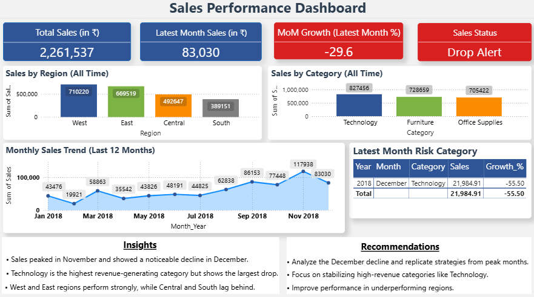

# Sales Performance Analysis

## Dashboard Preview

---

## Overview
Sales performance analysis project involving data cleaning, transformation, and analysis to understand sales trends and performance across categories and regions. The project includes building a dashboard to track key metrics, identify recent changes, and highlight important business insights.

---

## Project Workflow

### 1. Data Collection
- Raw sales data collected from CSV file

### 2. Data Cleaning & Preparation
- Handled missing values
- Converted data types (dates, numbers)
- Created Month_Year for time-based analysis

### 3. Data Analysis
- Calculated key metrics:
  - Total Sales
  - Monthly Sales
  - Month-over-Month Growth
- Analyzed performance by:
  - Category
  - Region

### 4. Dashboard (Power BI)
- Built a dashboard to track:
  - Overall sales performance
  - Monthly sales trend (last 12 months)
  - Sales by category and region (all time)
  - Latest month performance indicators
  - Risk category identification

---

## Key Insights
- Sales peaked in November and showed a noticeable decline in December
- Technology is the highest revenue-generating category but shows the largest drop
- West and East regions perform strongly, while Central and South lag behind

---

## Recommendations
- Analyze the December decline and replicate strategies from peak months
- Focus on stabilizing high-revenue categories like Technology
- Improve performance in underperforming regions

---

## Tools Used
- Python (Pandas)
- Power BI

---

## Files Included
- Raw dataset (CSV)
- Cleaned dataset
- Python script for data processing
- Power BI dashboard file

---

## Conclusion
This project demonstrates how sales data can be cleaned, analyzed, and visualized to understand performance trends and support business decision-making.
